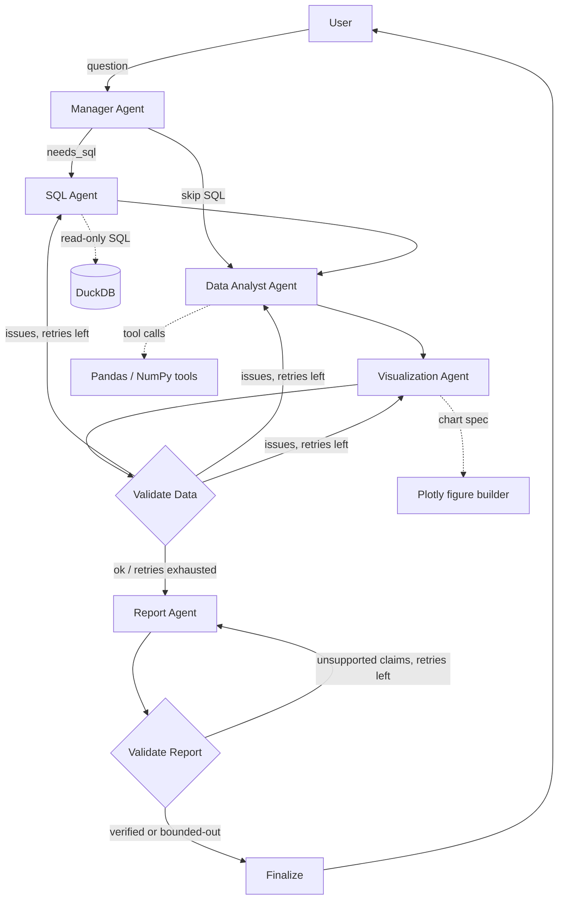
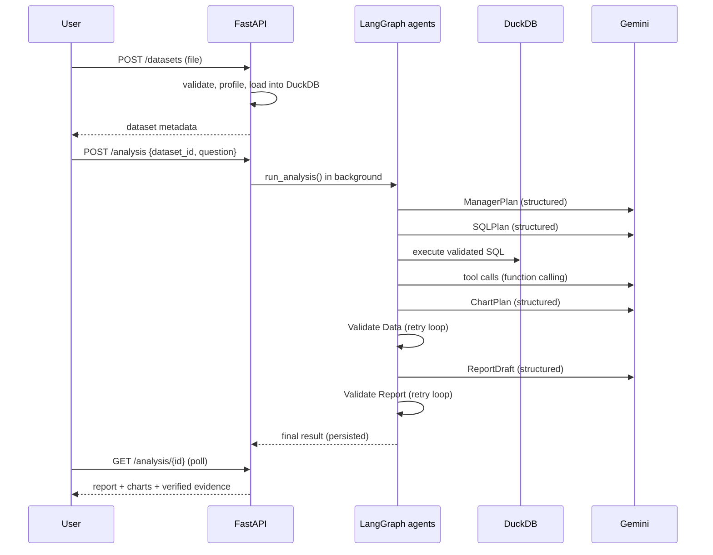

# Insightica

Upload a CSV / XLSX / Parquet file, ask a question in plain English, and get back a business-
friendly report where **every number is computed by real code and verified against the data**
before it reaches you — not generated as plausible-sounding text.

> "Why did revenue decrease in Q3?" → the Manager, SQL, Data Analyst and Visualization agents
> inspect your actual dataset, run real DuckDB queries and Python/Pandas statistics, and the
> Validation Agent checks every percentage and dollar figure in the draft report against those
> computed results before it is shown to you. If a claim can't be verified, it is removed, not
> displayed.

## 1. Project overview

This is a portfolio-grade, end-to-end implementation of a multi-agent analytics platform:
FastAPI + LangGraph backend, DuckDB as the analytical engine, Google Gemini for reasoning, a
React/Vite/TypeScript frontend, PostgreSQL for application metadata, Docker Compose for local
orchestration, a pytest suite, and an evaluation harness against a realistic sample dataset.

## 2. Problem statement

Ask an LLM to "analyze this CSV and tell me why revenue fell" and it will often produce a
confident, wrong number — because it never actually computed one. This project's core design
constraint is: **Gemini plans, reasons and writes prose; it is never trusted to compute a number.**
Every number a user sees is either the direct output of a DuckDB query or a deterministic Python
tool, and the Validation Agent double-checks every cited number in the final report against those
results before anything is shown.

## 3. Features

- Upload CSV / XLSX / Parquet, with file-type, size and content validation and automatic profiling
  (row/column counts, types, missing values, ranges, top categories).
- Ask natural-language questions; follow-up questions ("which regions caused that?") resolve
  pronouns using a compact conversation summary (not full transcript replay).
- A six-agent LangGraph workflow with genuine tool calling (DuckDB SQL, a 9-function Pandas/NumPy
  statistics toolkit exposed to Gemini via native function calling, and controlled Plotly chart
  construction).
- A dedicated **Validation Agent** that verifies SQL success, statistical tool success, chart
  fidelity (a chart's rendered data points are diffed against its declared source rows), and every
  numeric claim in the drafted report against the computed evidence — with bounded, automatic
  retries and repair at every stage.
- A first-run **AI Configuration** page: the app cannot be used until a Gemini key is tested and
  a temporary, server-side-only session is created. The key is never sent to the browser, logged,
  or stored in a database.
- Analysis history per dataset and per conversation.

## 4. Architecture



## 5. Multi-agent workflow

1. **Manager Agent** — understands the question (resolving follow-ups from conversation context),
   decides intent, metric, dimensions, time periods, and which downstream agents are needed;
   returns a structured `ManagerPlan`. Any planned column that doesn't actually exist in the
   dataset is dropped before it reaches other agents.
2. **SQL Agent** — writes DuckDB SQL against the *real* schema (never invents columns), validated
   by a token-based read-only SQL guard, executed with a timeout and row cap. Failures are repaired
   with a targeted retry that includes the exact error.
3. **Data Analyst Agent** — Gemini calls a fixed toolkit of 9 deterministic Python functions
   (`dataset_profile`, `describe_column`, `calculate_statistics`, `calculate_percentage_change`,
   `detect_outliers`, `calculate_correlation`, `group_by_analysis`, `time_series_analysis`,
   `contribution_analysis`) via the Gemini SDK's native automatic function calling. Gemini never
   does arithmetic itself.
4. **Visualization Agent** — Gemini picks a chart *specification* (type, columns, title); Python
   builds the actual Plotly figure and a companion "expected series" used to verify the figure
   against its source data.
5. **Validation Agent (data phase)** — checks SQL success/row counts, tool success, and chart
   fidelity. Routes back to the specific failing agent with the exact error, bounded by
   `MAX_AGENT_RETRIES`.
6. **Report Agent** — writes the business report, citing an evidence reference (e.g.
   `sql0[1].pct_change`) and an exact claimed value for every finding.
7. **Validation Agent (report phase)** — resolves every citation against the real computed
   evidence store, checks the claimed value matches (within rounding), checks every percentage/
   currency figure written anywhere in the prose is backed by *some* cited value, and checks
   statement direction (e.g. "grew" vs. a negative computed change). Unsupported reports are sent
   back for a bounded number of repairs; if still unverified, the offending findings/prose are
   **removed before display**, never shown as if verified. An optional advisory Gemini review adds
   soft notes about over-claiming causation (never overrides the deterministic checks).
8. **Finalize** — assembles the response actually shown to the user, attaching the real computed
   `actual_value` next to every cited claim.

## 6. Agent responsibilities

| Agent | Talks to Gemini? | Talks to tools? | Can loop back to it? |
|---|---|---|---|
| Manager | Yes (structured output) | No | No |
| SQL Agent | Yes (structured output) | DuckDB | Yes, on validation failure |
| Data Analyst | Yes (native function calling) | Pandas/NumPy toolkit | Yes, on validation failure |
| Visualization | Yes (structured output) | Plotly figure builder | Yes, on validation failure |
| Validation (data) | No (deterministic) | — | is the router |
| Report | Yes (structured output) | — | Yes, on validation failure |
| Validation (report) | Optional advisory review only | Evidence store | is the router |
| Finalize | No | — | terminal |

## 7. Tool architecture

- `app/tools/sql_validator.py` — hand-written tokenizer (not regex-on-raw-SQL) that allows exactly
  one read-only `SELECT`/`WITH` statement referencing only the dataset's own table (or its CTEs),
  blocking DDL/DML, file-access functions, and multi-statement injection — even when keywords
  appear inside string or quoted-identifier literals.
- `app/tools/duckdb_tools.py` — loads uploaded data into DuckDB, executes validated SQL with a
  timeout and a hard row cap (`LIMIT n+1` to detect truncation).
- `app/tools/pandas_tools.py` / `statistics_tools.py` — the 9-function analyst toolkit; every
  function validates its column arguments against the real dataset schema before touching data.
- `app/tools/visualization_tools.py` — turns a model-chosen chart spec into a Plotly figure via
  Python, with `verify_chart` independently recomputing the plotted series from source rows and
  diffing them against the actual figure, so a chart can never silently diverge from its data.
- `app/validation/evidence.py` + `claims.py` — flattens every SQL/tool result into a ref-addressable
  evidence store, then checks the report's cited values, uncited numeric claims, and stated
  direction against it.

## 8. Data flow



## 9. Gemini integration

All AI/LLM functionality goes through `app/gemini/service.py::GeminiService`, using the current
`google-genai` SDK (`from google import genai`), never the retired `google-generativeai` package.
No sampling parameters (temperature/top_p/top_k) are set, per Google's current guidance. Three
capabilities are used: `generate` (plain text), `generate_structured` (Pydantic-schema-constrained
JSON, via `response_schema`), and `generate_with_tools` (native automatic function calling for the
Data Analyst Agent). `GEMINI_MODEL` is configurable via environment variable; no key is ever
hardcoded.

## 10. API-key setup

On first load the app shows `/setup`, not the dashboard. The user pastes a Gemini API key
(password-masked, with a reveal toggle), clicks **Test Connection** (`POST
/api/v1/config/test-gemini`), and only after a successful test can they create a session (`POST
/api/v1/config/session`) and continue. `/setup` links to Google AI Studio
(`https://aistudio.google.com/app/apikey`) and includes step-by-step instructions.

## 11. Security

- **The Gemini API key is never stored** — not in Postgres, not in a file, not in a frontend
  variable, not in logs. It lives only in an in-process `SessionStore` (see `app/core/sessions.py`),
  keyed by an opaque random token that is the *only* thing sent to the browser, in an HttpOnly,
  SameSite cookie. Sessions expire after `API_KEY_SESSION_TTL_MINUTES` (default 60); an expired
  session gets a 401 that the frontend turns into a redirect to `/setup`.
- Structured JSON logging (`app/core/logging.py`) redacts anything matching a Gemini key pattern
  or any field named `api_key`/`token`/`password`/etc., even inside nested error payloads.
- Uploads are validated by extension, size, and magic-byte content sniffing
  (`app/ingestion/file_validation.py`); filenames are sanitized and never used as a filesystem
  path (files are stored under server-generated UUID names).
- All LLM-generated SQL passes through the token-based read-only validator before DuckDB ever sees
  it — no `exec()`, `eval()`, or shell execution anywhere in the codebase.
- CORS is explicitly configured (`CORS_ORIGINS`); errors return a generic message with a stable
  `code`, with tracebacks only in server-side logs.

## 12. Validation system

See section 5, steps 5 and 7, and `app/validation/claims.py`. The rejection rule from the original
brief — "if the agent generates '35%' while the actual result is 17.8%, the validator must reject
it" — is a literal unit test: `test_claims_validation.py::test_fabricated_number_is_rejected` and
the end-to-end `test_orchestration.py::test_fabricated_percentage_is_rejected_then_repaired` /
`test_persistent_fabrication_never_reaches_the_user_as_verified`.

## 13. Tech stack

Backend: FastAPI, LangGraph, DuckDB, Pandas/NumPy, Plotly, SQLAlchemy, PostgreSQL, google-genai.
Frontend: React 18, Vite, TypeScript, Tailwind CSS, plotly.js. Infra: Docker Compose.

## 14. Folder structure

```
multi-agent-data-analyst/
├── backend/
│   ├── app/
│   │   ├── agents/         manager, sql_agent, analyst_agent, visualization_agent,
│   │   │                   validation_agent, report_agent, finalize, base, prompts
│   │   ├── tools/           sql_validator, duckdb_tools, pandas_tools, statistics_tools,
│   │   │                   visualization_tools
│   │   ├── orchestration/   state, deps, graph (LangGraph wiring), runner
│   │   ├── validation/      evidence store, numeric-claim checking
│   │   ├── gemini/          GeminiService (the only module that calls the Gemini API)
│   │   ├── ingestion/       file validation, loaders, profiler
│   │   ├── database/        SQLAlchemy engine/session
│   │   ├── models/          ORM models (datasets, sessions, messages, results)
│   │   ├── schemas/         Pydantic schemas (API + LLM structured outputs)
│   │   ├── services/        dataset/analysis services (business logic, used by routes)
│   │   ├── core/            config, logging, errors, sessions, rate limiting, serialization
│   │   └── api/routes/      config, datasets, analysis, health
│   ├── tests/               57+ pure-logic tests, 8 full-orchestration tests (fake Gemini/DuckDB),
│   │                        10 GeminiService tests (fake SDK client), API integration tests
│   └── requirements.txt
├── frontend/
│   └── src/{pages,components,services,hooks,types}
├── evaluation/{datasets,scripts,results}
├── sample_data/{sales.csv, generate_sales.py}
├── docker-compose.yml
├── .env.example
└── LICENSE
```

## 15. Local setup (without Docker)

```bash
cd backend
python3 -m venv .venv && source .venv/bin/activate
pip install -r requirements.txt
export DATABASE_URL=sqlite:///./data/app.db
export DUCKDB_PATH=./data/analytics.duckdb
uvicorn app.main:app --reload --port 8000
```

```bash
cd frontend
npm install
cp ../.env.example .env   # set VITE_API_BASE_URL=http://localhost:8000
npm run dev
```

Open the frontend, complete `/setup` with a Gemini API key, upload `sample_data/sales.csv`, and
ask: *"Why did revenue decrease in Q3?"*

## 16. Docker setup

```bash
cp .env.example .env
docker compose up --build
```

This starts `postgres`, `backend` (port 8000) and `frontend` (port 5173). DuckDB requires no
separate container — it runs embedded inside the backend process, persisted to a Docker volume.

## 17. Example questions

- "What was total revenue?"
- "Which region had the highest sales?"
- "Why did revenue decline in Q3?" → then follow up with "Which products caused that?"
- "Which product category grew fastest?"
- "Are there any unusual values in the revenue column?"
- "Is there a correlation between discount and quantity?"

## 18. API documentation

| Method | Path | Purpose |
|---|---|---|
| POST | `/api/v1/config/test-gemini` | Validate a key without creating a session |
| POST | `/api/v1/config/session` | Validate + create a temporary server-side session (sets cookie) |
| GET | `/api/v1/config/session` | Current session status |
| POST | `/api/v1/config/logout` | Clear the session |
| POST | `/api/v1/datasets` | Upload a dataset (multipart) |
| GET | `/api/v1/datasets` | List datasets |
| GET | `/api/v1/datasets/{id}` | Dataset metadata |
| GET | `/api/v1/datasets/{id}/profile` | Full profile (columns, types, stats, sample rows) |
| DELETE | `/api/v1/datasets/{id}` | Delete a dataset |
| POST | `/api/v1/analysis` | Start an analysis (202, runs in background) |
| GET | `/api/v1/analysis` | History (filter by `dataset_id`/`session_id`) |
| GET | `/api/v1/analysis/{id}` | Poll status / fetch full result |
| GET | `/api/v1/health` | Liveness + DB check |

## 19. Testing

```bash
cd backend
pip install -r requirements.txt
pytest -v
```

The suite is layered so most of it needs neither a network connection nor an API key:

- **Pure-logic tests** (SQL validator, statistics, ingestion/profiling, chart construction,
  evidence/claim validation, sessions, logging redaction, serialization) — plain Python, no mocks.
- **`test_orchestration.py`** — runs the *real* LangGraph workflow with a scripted `FakeGemini` and
  a SQLite-backed engine standing in for DuckDB, covering the happy path, SQL repair-then-succeed,
  a fabricated-percentage rejection that gets repaired, a fabrication that persists past the retry
  budget (and is confirmed **never shown** to the user), an unsafe-SQL attempt being blocked, a
  simulated Gemini outage, and follow-up-question context.
- **`test_gemini_service.py`** — retries/backoff, error classification, structured-output parsing,
  all against a fake SDK client (no real API key needed).
- **`test_api.py`** — boots the real FastAPI app (SQLite + real DuckDB) with a fake Gemini
  dependency override, covering the full setup → upload → analyze → poll → history lifecycle.

**Honest note on this repository's own test run:** this project was built in a sandboxed
environment with no PyPI network access, so `fastapi`, `sqlalchemy`, `duckdb`, `langgraph`,
`pydantic` and `google-genai` could not be `pip install`-ed there. Every module was compiled
(`python -m py_compile`) and the pure-logic suite (57 tests) ran directly. For the orchestration
and Gemini-service suites, minimal same-interface stand-ins for `pydantic`, `langgraph`, `plotly`
and `google.genai` were used purely as an offline harness to execute the real application code
(`app/agents/*.py`, `app/orchestration/*.py`, `app/gemini/service.py` — nothing about the
production modules themselves was mocked) — **74 tests passed**, and a mutation check (deliberately
breaking the numeric validator) confirmed the suite actually fails when the logic is wrong. `test_api.py`
is included and syntactically verified but requires the real packages
(`pip install -r requirements.txt`, which needs network) to execute — that is expected to work in
any normal environment and is exactly what CI / the user's machine will do.

## 20. Evaluation

See `evaluation/README.md`. `evaluation/scripts/run_eval.py` runs 5 questions against the real
agent graph and `sample_data/sales.csv`, either with a scripted Gemini (offline, checks the
pipeline mechanics) or `--live` with a real `GEMINI_API_KEY` (checks real model quality). No scores
are fabricated or pre-committed to this repository.

## 21. Design decisions

- **Gemini plans, code computes.** Every number in this app traces back to a DuckDB query or a
  pure-Python statistics function — never to LLM arithmetic. This is why the Validation Agent can
  make a hard, mechanical guarantee rather than an LLM-judged one.
- **Structured output over free text everywhere it matters.** Every agent-to-agent contract is a
  Pydantic schema (`app/schemas/llm.py`), so downstream code never has to parse prose.
- **Bounded retries at two distinct checkpoints** (data validity, then report validity) rather than
  one big retry loop, so a SQL problem and a "the report over-claimed" problem get routed to the
  specific agent that can actually fix them.
- **The API key never leaves the server.** A short-lived, in-memory, token-referenced session was
  chosen over even a moment of client-side storage.
- **DuckDB over a full data warehouse.** The brief's target is single-dataset, single-session
  analysis; DuckDB's embedded, zero-ops analytical engine fits that scope exactly, while
  PostgreSQL is reserved for what actually needs durability (metadata, history).

## 22. Failure / retry handling

- SQL failure → targeted repair prompt containing the exact SQL and error, bounded by
  `MAX_AGENT_RETRIES` (default 3); on exhaustion, the app proceeds with whatever tool-based results
  exist, or fails cleanly with a plain-language message — never an infinite loop, never a crash.
- Statistics tool failure → the analyst agent sees the tool's own error message and can correct its
  arguments in the same turn (native function calling); repeated failure is caught at the data
  validation checkpoint.
- Chart failure → dropped chart-by-chart (one bad chart doesn't block the other charts or the
  report), with a warning surfaced to the user.
- Fabricated/unsupported report claims → repaired up to `MAX_AGENT_RETRIES` times; if still
  unverified, offending findings/prose are stripped from the response before it is ever returned,
  and the response is marked `partial` with an explicit warning.
- Any agent crash or Gemini outage → caught by `BaseAgent.__call__`, turned into a plain-language
  `fatal_error`, and every graph router sends the run straight to `finalize` — the user gets a
  clear error, not a hung request or a stack trace.

## 23. Limitations

- Single-table analysis per question (no cross-dataset joins).
- The read-only SQL guard is a practical, tested allowlist, not a formally verified parser; it
  covers DuckDB's common analytical surface, not every possible DuckDB SQL construct.
- `test_api.py` needs real dependencies installed to run (see section 19's honest note).
- Chart types are limited to the 7 in `visualization_tools.CHART_TYPES`; no multi-panel dashboards.
- Conversation context is a compact summary of recent turns, not full transcript replay — very
  long, deeply nested follow-up chains may lose some nuance.

## 24. Future improvements

- Multi-dataset joins and a schema-relationship inference step.
- Streaming agent progress over WebSocket/SSE instead of polling.
- Per-user auth and multi-tenant dataset isolation (currently single-tenant by design, matching the
  brief's scope).
- A caching layer for repeated identical SQL/tool calls across a session.
- Exporting a completed report as PDF/PPTX.
